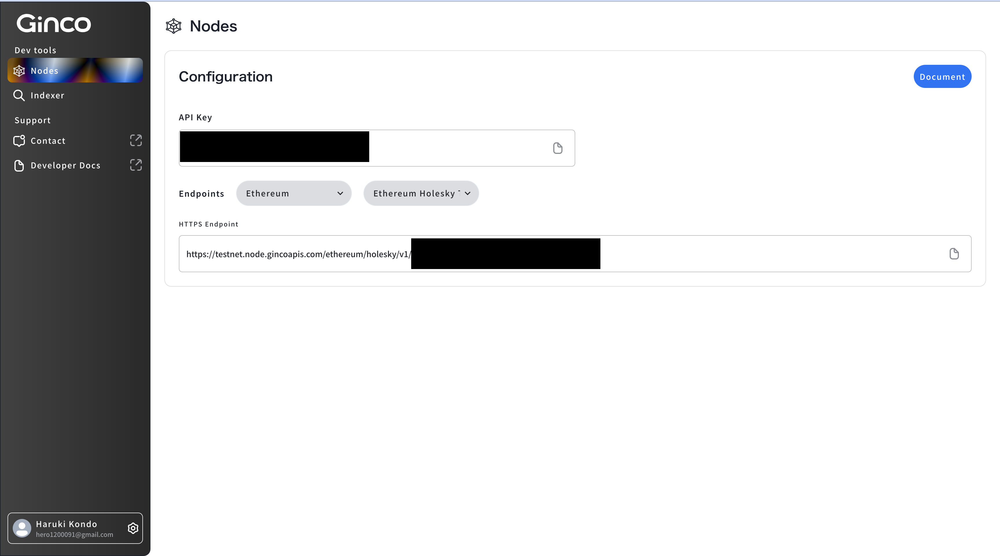

# Ginco-One-Platform-Sample

This is a repo for Ginco-One-Platform-Sample.

[](https://github.com/mashharuki/Ginco-One-Platform-Sample/actions/workflows/ci.yml)

## How to work

- ### **setUp**

  1.  You need to create Ginco API Key.

      [Ginco One Platform Site](https://console.cloud.ginco.com/nodes/api)

      

  2.  You need to create `.env` file & fillout these values

      ```txt
      PRIVATE_KEY=""
      GINCO_API_KEY=""
      ```

  3.  install

      ```bash
      yarn
      ```

- ### **commands**

  - **compile**

    ```bash
    yarn compile
    ```

  - **test**

    ```bash
    yarn test
    ```

  - **deploy contract**

    ```bash
    yarn deploy:Lock --network holesky
    ```

  - **get chain info**

    ```bash
    yarn getChainInfo --network holesky
    ```

  - **get balance**

    ```bash
    yarn getBalance --network holesky
    ```

  - **callReadMethod**

    ```bash
    yarn callReadMethod --network holesky
    ```

  - **calWriteMethod**

    ```bash
    yarn callWriteMethod --network holesky
    ```

### 参考文献

1. [Ginco One Platform Site](https://console.cloud.ginco.com/nodes/api)
